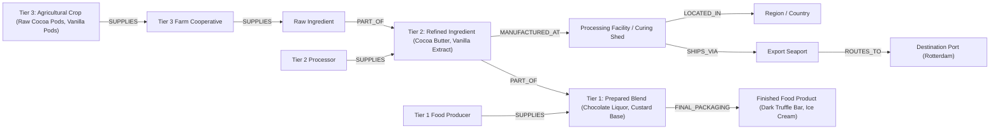

# ChainPulse Graph — Global Supply Chain Resilience & Impact Intelligence

[](https://fastapi.tiangolo.com)
[](https://console.cognodb.com)
[](https://react.dev)
[](https://vitejs.dev)
[](LICENSE)

A production-grade Graph Database application built for the **Wexa AI Take-Home Assignment**. **ChainPulse Graph** models an end-to-end multi-tier global supply chain network (raw cacao bean and vanilla pod plantations, sugar cane mills, regional processing refineries, export seaports, and finished luxury confectioneries, nitro cold brews, and organic ice creams).

It provides interactive force-directed graph exploration, real-time **cascading disruption blast-radius simulation**, **Single Point of Failure (SPOF)** bottleneck detection, and dynamic **alternate supplier matchmaking**.

## ⚡ Quick Start (Run in Under 60 Seconds)

ChainPulse Graph runs out of the box with **Zero-Config Demo Fallback Mode** (no database setup required), or connected to a live **CognoDB Cloud** instance.

### 🖥️ Terminal 1 — Backend (FastAPI)

```bash
# 1. Create and activate a Python virtual environment
# Windows (PowerShell):
python -m venv venv
.\venv\Scripts\Activate.ps1

# Windows (Command Prompt):
# venv\Scripts\activate.bat

# macOS / Linux:
# python3 -m venv venv && source venv/bin/activate

# 2. Install backend dependencies
pip install -r backend/requirements.txt

# 3. Start the FastAPI API server (port 8000)
# From the project root:
uvicorn app.main:app --app-dir backend --reload --port 8000

# OR from inside the backend directory:
# cd backend && uvicorn app.main:app --reload --port 8000
```

> 💡 **No credentials needed to test immediately**: The backend will automatically boot in *Offline Fallback Mode* with the full multi-tier supply chain graph dataset loaded in memory.

### 💻 Terminal 2 — Frontend (React + Vite)

```bash
# 1. Navigate to the frontend directory
cd frontend

# 2. Install dependencies (Node 18+)
npm install

# 3. Start the Vite dev server
npm run dev
```

### 🌐 Access Points & Endpoints

| Resource | URL | Description |
| :--- | :--- | :--- |
| **Interactive Dashboard** | [http://localhost:5173](http://localhost:5173) | Main visual graph workspace |
| **Interactive API Docs** | [http://localhost:8000/docs](http://localhost:8000/docs) | Swagger UI for exploring openCypher endpoints |
| **System Health API** | [http://localhost:8000/api/health](http://localhost:8000/api/health) | Live CognoDB / Mock status |
| **ReDoc API Spec** | [http://localhost:8000/redoc](http://localhost:8000/redoc) | Detailed REST schema documentation |

---

## 1. Why a Graph Database?

### 1. Arbitrary-Depth Multi-Hop Cascades
- **The Challenge**: *"If a tropical cyclone hits vanilla curing sheds in Madagascar or severe drought strikes cacao farms in Ghana, which finished dessert and beverage products across 4 tiers are impacted, and what is our daily revenue at risk?"*
- **SQL Approach**: Requires recursive Common Table Expressions (`WITH RECURSIVE`) and multiple self-joins. As depth increases, execution time and memory grow exponentially due to repeated table scans and hash joins.
- **Graph Approach**: In openCypher, relationships are stored as direct physical pointers. Traversing from a failed node to downstream products is an instantaneous traversal:
  ```cypher
  MATCH path = (origin {id: $node_id})-[*1..6]->(p:Product)
  RETURN p.name, p.revenue_impact_daily_usd, length(path) AS depth
  ```

### 2. Single Point of Failure (SPOF) Discovery Across Sub-assemblies
- **The Challenge**: Detecting ingredients that lack dual-sourcing across arbitrary levels of the Bill of Materials (BOM) hierarchy.
- **SQL Approach**: Requires joining products $\to$ intermediate blends $\to$ raw ingredients $\to$ suppliers, grouping by ingredient and counting distinct suppliers across multiple join layers.
- **Graph Approach**: Graph degree centrality and pattern matching identify sole-source bottlenecks across the entire network in a single query:
  ```cypher
  MATCH (p:Product)<-[:PART_OF*1..4]-(c:Component)
  OPTIONAL MATCH (s:Supplier)-[:SUPPLIES]->(c)
  WITH c, p, count(DISTINCT s) AS supplier_count, collect(DISTINCT s.name) AS suppliers
  WHERE supplier_count = 1
  RETURN c.name, suppliers[0] AS sole_supplier, collect(DISTINCT p.name) AS affected_products
  ```

### 3. Dynamic Alternate Sourcing & Shortest-Path Rerouting
- Relationships in graph databases carry first-class properties (e.g. `lead_time_days`, `is_primary`, `reliability_score`). When a node fails, the graph instantaneously evaluates alternate pathways and shortest-lead-time suppliers.

---

## 2. Graph Data Model & Schema



### Labeled Nodes & Properties:
- **`Product`**: `id`, `name`, `category`, `revenue_impact_daily_usd`, `status`
- **`Component`**: `id`, `name`, `type`, `lead_time_days`, `unit_cost_usd`
- **`Supplier`**: `id`, `name`, `tier`, `country`, `reliability_score` (0–1), `risk_rating`
- **`Facility`**: `id`, `name`, `type` (*Fab, Smelter, Assembly*), `country`, `status`
- **`LogisticsHub`**: `id`, `name`, `type` (*Seaport, Air Hub*), `congestion_level`
- **`Region`**: `id`, `name`, `geopolitical_risk_score`, `climate_risk_score`

### Typed Relationships:
- `(:Supplier)-[:SUPPLIES {lead_time_days, is_primary}]->(:Component)`
- `(:Component)-[:PART_OF {quantity_required, is_critical}]->(:Component | :Product)`
- `(:Component)-[:MANUFACTURED_AT]->(:Facility)`
- `(:Facility)-[:LOCATED_IN]->(:Region)`
- `(:Facility)-[:SHIPS_VIA {transit_days}]->(:LogisticsHub)`
- `(:LogisticsHub)-[:ROUTES_TO {transit_days}]->(:LogisticsHub)`

---

## 3. Core Parameterized Cypher Queries

All queries in the backend use **100% parameterized openCypher** executed via the official `neo4j` Python driver:

### 1. Multi-Hop Disruption Blast Radius (1..6 Hops)
```cypher
MATCH path = (origin)-[*1..6]->(p:Product)
WHERE origin.id IN $disrupted_ids
WITH p, path, length(path) AS depth
ORDER BY p.revenue_impact_daily_usd DESC, depth ASC
RETURN p.id AS product_id,
       p.name AS product_name,
       p.category AS category,
       p.revenue_impact_daily_usd AS daily_revenue_risk,
       depth,
       [n IN nodes(path) | {id: n.id, label: labels(n)[0], name: coalesce(n.name, n.id)}] AS impact_path,
       [n IN nodes(path) | n.id] AS path_node_ids
```

### 2. Single Point of Failure (SPOF) Detection
```cypher
MATCH (p:Product)<-[:PART_OF*1..4]-(c:Component)
OPTIONAL MATCH (s:Supplier)-[sup:SUPPLIES]->(c)
WITH c, p, count(DISTINCT s) AS supplier_count, collect(DISTINCT s) AS suppliers
WHERE supplier_count = 1
WITH c, suppliers[0] AS sole_supplier_node, collect(DISTINCT p.name) AS affected_products, count(DISTINCT p) AS product_count
RETURN c.id AS component_id,
       c.name AS component_name,
       c.lead_time_days AS lead_time_days,
       c.unit_cost_usd AS unit_cost,
       sole_supplier_node.name AS sole_supplier,
       sole_supplier_node.id AS supplier_id,
       sole_supplier_node.country AS supplier_country,
       affected_products,
       product_count,
       CASE 
           WHEN c.lead_time_days >= 60 OR product_count >= 2 THEN 'CRITICAL'
           ELSE 'HIGH'
       END AS risk_level
ORDER BY product_count DESC, c.lead_time_days DESC
```

### 3. Qualified Alternate Supplier Finder
```cypher
MATCH (c:Component {id: $component_id})<-[r:SUPPLIES]-(alt:Supplier)
WHERE alt.id <> $disrupted_supplier_id
RETURN alt.id AS supplier_id,
       alt.name AS supplier_name,
       alt.tier AS tier,
       alt.country AS country,
       alt.reliability_score AS reliability,
       alt.risk_rating AS risk_rating,
       r.lead_time_days AS lead_time_days,
       r.is_primary AS is_primary
ORDER BY r.lead_time_days ASC, alt.reliability_score DESC
```

---

## 4. Setup & Detailed Configuration

### Prerequisites
- **Python 3.10+** (Python 3.11 or 3.12 recommended)
- **Node.js 18+** & `npm`
- (Optional) Free **CognoDB Cloud** database from [console.cognodb.com](https://console.cognodb.com). *(The system includes an automatic offline demo fallback with rich mock data if running without cloud credentials)*.

---

### Mode A: Zero-Config Instant Demo Mode (No Cloud DB Needed)

If you just want to evaluate the UI, algorithms, and simulation immediately:

1. **Start the Backend**:
   ```bash
   python -m venv venv
   # Windows (PowerShell):
   .\venv\Scripts\Activate.ps1
   # macOS / Linux:
   source venv/bin/activate

   pip install -r backend/requirements.txt
   uvicorn app.main:app --app-dir backend --reload --port 8000
   ```

2. **Start the Frontend**:
   ```bash
   cd frontend
   npm install
   npm run dev
   ```

3. Open **[http://localhost:5173](http://localhost:5173)**. The top navbar will display `MOCK DEMO MODE` with full interactivity.

---

### Mode B: Connected Live CognoDB Cloud Mode

To run directly against a live CognoDB cloud database instance using openCypher Bolt protocol:

1. **Provision Database**:
   - Sign up for free at [https://console.cognodb.com](https://console.cognodb.com).
   - Create a free (c0) database instance.
   - Copy your Connection URI (`bolt+s://<instance-id>.databases.cognodb.cloud`) and password.

2. **Configure Environment Variables**:
   Create or edit `backend/.env` with your instance details:
   ```ini
   COGNDB_URI=bolt+s://your-instance-id.databases.cognodb.cloud
   COGNDB_USER=cognodb
   COGNDB_PASSWORD=your-generated-password
   COGNDB_DATABASE=neo4j
   PORT=8000
   ```

3. **Seed the Graph Database**:
   Execute the standalone seeding script to create constraints, indices, nodes, and relationships:
   ```bash
   python backend/seed.py
   ```

4. **Start the Backend**:
   ```bash
   uvicorn app.main:app --app-dir backend --reload --port 8000
   ```
   The backend logs will confirm: `[INFO] Connected to CognoDB Cloud successfully.`

5. **Start the Frontend**:
   ```bash
   cd frontend
   npm install
   npm run dev
   ```

---

### 5. Running Automated Tests

Run the test suite with `pytest` to validate all endpoints, models, disruption blast-radius math, and fallback handling:

```bash
# From workspace root:
pytest backend/tests

# Verbose output with timing:
pytest -v backend/tests
```

---

### 6. Troubleshooting & Tips

- **Windows PowerShell Execution Policy**: If you receive a script execution error when activating `venv`, run:
  ```powershell
  Set-ExecutionPolicy -Scope Process -ExecutionPolicy Bypass
  .\venv\Scripts\Activate.ps1
  ```
- **Port Conflicts**: If port `8000` or `5173` is occupied, change the port in `backend/.env` or pass `--port <number>` to `uvicorn`, and update `frontend/vite.config.js` proxy settings accordingly.
- **Frontend Code Quality & Linting**: Run `npm run lint` in the `frontend/` directory to run Oxlint.

---

## 5. Project Architecture & Directory Structure

```
supplychain/
├── backend/
│   ├── app/
│   │   ├── __init__.py
│   │   ├── config.py             # Environment configuration (pydantic-settings)
│   │   ├── db.py                 # Neo4j/CognoDB driver connection pooling & health checks
│   │   ├── queries.py            # Parameterized openCypher query library
│   │   ├── models.py             # Pydantic schemas for graph nodes, links & simulations
│   │   ├── mock_data.py          # Embedded realistic dataset for offline demo fallback
│   │   ├── main.py               # FastAPI application with CORS & lifecycle management
│   │   └── routes/
│   │       ├── health.py         # /api/health
│   │       ├── graph.py          # /api/graph
│   │       ├── simulation.py     # /api/simulation/disrupt & /api/simulation/alternate-suppliers
│   │       ├── spof.py           # /api/spof
│   │       └── products.py       # /api/products & /api/products/{id}/bom
│   ├── tests/
│   │   └── test_api.py           # Pytest test suite for all endpoints
│   ├── seed.py                   # Standalone seed script for CognoDB instance
│   ├── requirements.txt          # Python dependencies
│   └── .env                      # Local secrets (ignored by git)
├── frontend/
│   ├── src/
│   │   ├── components/
│   │   │   ├── Navbar.jsx        # Live CognoDB health indicator & action buttons
│   │   │   ├── GraphCanvas.jsx   # Interactive HTML5 Canvas force-directed supply chain graph
│   │   │   ├── DisruptionPanel.jsx # Disruption lab with disaster scenario presets
│   │   │   ├── SPOFRadar.jsx     # Single Point of Failure risk matrix
│   │   │   ├── NodeDrawer.jsx    # Inspector drawer for selected entity + alternate suppliers
│   │   │   ├── ProductBOMModal.jsx # Multi-tier Bill of Materials hierarchical tree
│   │   │   ├── CypherModal.jsx   # Live openCypher query viewer with execution metrics
│   │   │   └── StatsCards.jsx    # Top-level resilience KPIs & daily revenue at risk
│   │   ├── services/
│   │   │   └── api.js            # Frontend API client
│   │   ├── styles/
│   │   │   ├── variables.css     # Vanilla CSS design tokens
│   │   │   ├── base.css          # Reset, typography, scrollbars
│   │   │   ├── components.css    # Cards, badges, buttons, drawers, modals
│   │   │   └── graph.css         # Canvas HUD, overlays, legend, glow animations
│   │   ├── App.jsx               # Main dashboard container
│   │   ├── index.css             # Stylesheet bundle entry point
│   │   └── main.jsx              # React DOM entry point
│   ├── index.html                # Semantic HTML5 with Inter & Outfit typography
│   ├── package.json
│   └── vite.config.js            # Dev proxy to backend on port 8000
├── .gitignore                    # Secrets, virtualenvs, and node_modules protection
└── README.md                     # Documentation
```

---

## 6. Key Features Summary

- **Interactive Force-Directed Graph Canvas**: High-performance HTML5 Canvas rendering with physics simulation, custom glowing nodes, link particle flow, zoom/pan controls, and entity search.
- **Disruption Simulator**: Trigger preset disaster scenarios (e.g. Taiwan Semiconductor Fab Shock, Chilean Lithium Smelter Strike) or click any node to simulate an outage and watch red cascade waves ripple across the graph.
- **Single Point of Failure (SPOF) Radar**: Proactively identifies sole-source components with zero backup suppliers.
- **Alternate Sourcing Engine**: Automatically discovers qualified backup suppliers with lead time and reliability scoring.
- **Live openCypher Inspector**: Transparently displays raw parameterized Cypher queries with latency timings for judges and reviewers.
